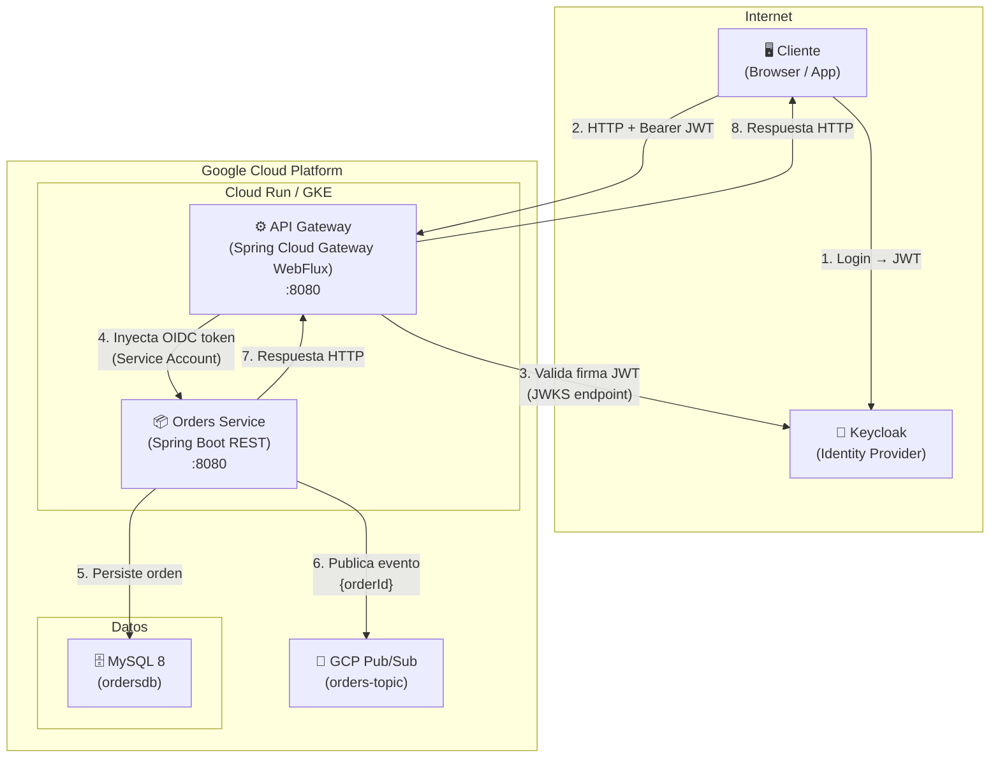
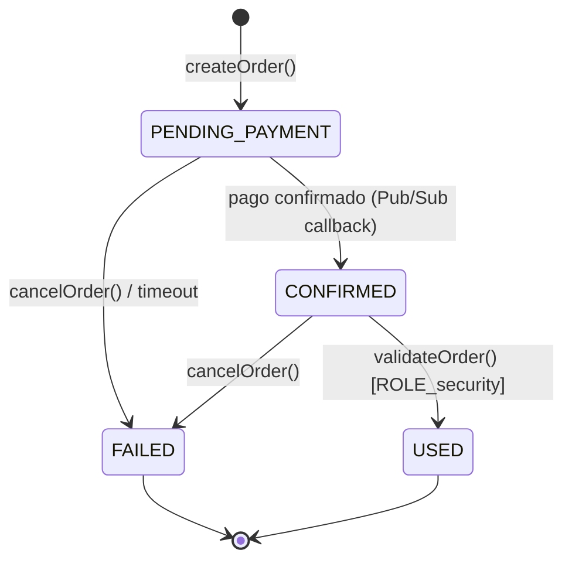
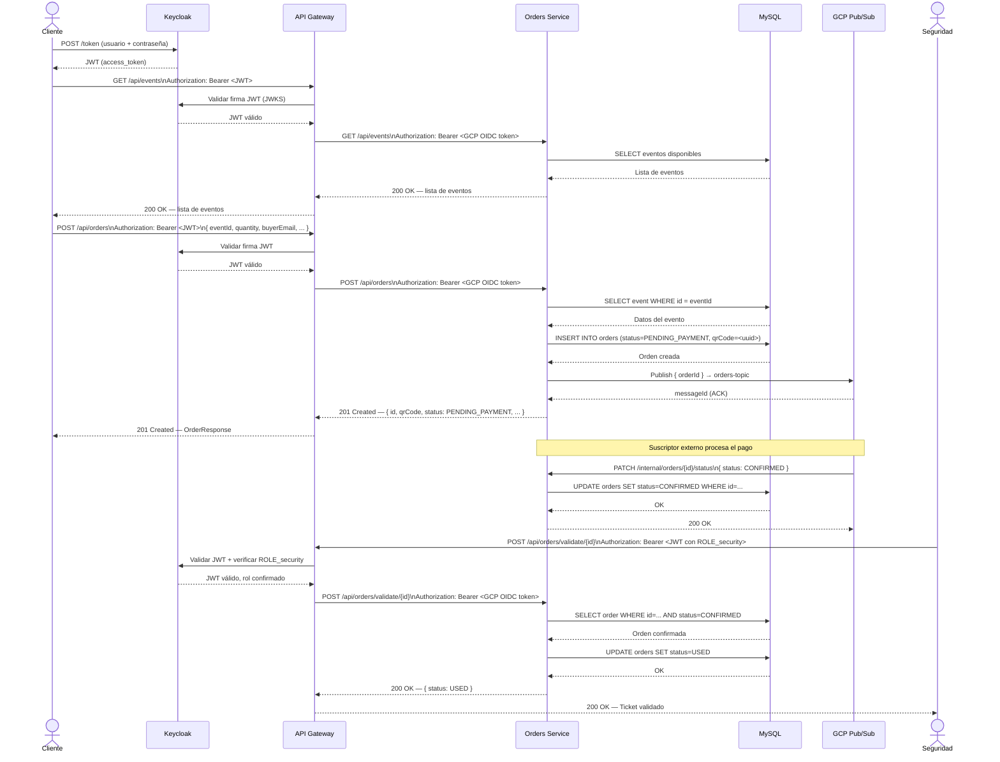

# TicketApp — Documento Técnico

**Sistemas Distribuidos II · 2026**

Sistema distribuido para gestión de compra y validación de entradas para eventos musicales.

---

## Tabla de contenidos

1. [Arquitectura](#1-arquitectura)
2. [Despliegue](#2-despliegue)
3. [Seguridad](#3-seguridad)
4. [Flujo funcional](#4-flujo-funcional)

---

## 1. Arquitectura

### 1.1 Diagrama de componentes y conectores



> **Nota:** `/internal/**` es bloqueado en el Gateway con `denyAll()`. Ningún cliente externo puede alcanzar directamente los endpoints internos del Orders Service.

---

### 1.2 Justificación de decisiones

| Decisión | Alternativa descartada | Justificación |
|---|---|---|
| **Spring Cloud Gateway (WebFlux / reactivo)** | Spring MVC proxy | SCG requiere el stack no bloqueante de Project Reactor para gestionar eficientemente muchas conexiones concurrentes sin agotar el thread pool. |
| **Keycloak como Identity Provider** | JWT propio / Auth0 | Keycloak es open-source, auto-hospedable y compatible con OAuth 2.0 + OIDC out-of-the-box. Centraliza la gestión de usuarios y roles sin depender de un SaaS externo. |
| **GCP OIDC Service Account entre Gateway y Orders Service** | API Key compartida | Los tokens OIDC son de corta duración, criptográficamente firmados y vinculados a la identidad de infraestructura (Service Account), siguiendo el modelo *Zero Trust*. Una API key estática es una credencial permanente de alto riesgo. |
| **GCP Pub/Sub para notificación de órdenes** | Llamada sincrónica | Pub/Sub desacopla la confirmación de orden de cualquier procesamiento posterior (ej. envío de email, actualización de stock). La creación de la orden no bloquea ni falla por dependencias externas. |
| **MySQL 8 para persistencia** | MongoDB / PostgreSQL | MySQL es ampliamente compatible con Cloud Run y Cloud SQL de GCP. El modelo relacional es apropiado dado que las entidades (Order, Event) tienen esquema fijo y relaciones definidas. |
| **Endpoint `/internal/**` con `denyAll()` en el Gateway** | Autenticación separada | El bloqueo en el Gateway garantiza que ninguna petición llegue al servicio interno desde el exterior, independientemente de las credenciales presentadas. Es defensa en profundidad. |
| **Docker multi-stage build (builder + runtime)** | Fat JAR directo | El stage de builder compila con Gradle; el stage de runtime usa solo el JRE (alpine), reduciendo la imagen final y su superficie de ataque. |

---

## 2. Despliegue

### 2.1 Prerrequisitos

| Herramienta | Versión mínima |
|---|---|
| Docker | 24.x |
| Docker Compose | v2.x (plugin) |
| Java JDK | 21 (solo para desarrollo local sin Docker) |
| Gradle | 8.11 (wrapper incluido) |
| Cuenta GCP + Service Account | — |
| Instancia Keycloak | Realm `Final-TP` configurado |

---

### 2.2 Variables de entorno

Copiar y completar el archivo de ejemplo antes de levantar los servicios:

```bash
cp TicketApp/.env.example TicketApp/.env
```

| Variable | Descripción | Ejemplo |
|---|---|---|
| `SPRING_DATASOURCE_URL` | JDBC URL de MySQL | `jdbc:mysql://mysql:3306/ordersdb?...` |
| `SPRING_DATASOURCE_USERNAME` | Usuario de la base de datos | `orderuser` |
| `SPRING_DATASOURCE_PASSWORD` | Contraseña del usuario | `orderpass` |
| `MYSQL_ROOT_PASSWORD` | Contraseña root de MySQL | `rootpass` |
| `MYSQL_DATABASE` | Nombre de la base de datos | `ordersdb` |
| `MYSQL_USER` | Usuario MySQL | `orderuser` |
| `MYSQL_PASSWORD` | Contraseña MySQL | `orderpass` |
| `GCP_PROJECT_ID` | ID del proyecto de GCP | `sistemas-distribuidos-ii-2026` |
| `GCP_PUBSUB_TOPIC_ID` | Topic de Pub/Sub | `orders-topic` |
| `KEYCLOAK_ISSUER_URI` | URI del realm Keycloak | `https://keycloak.example.com/realms/Final-TP` |
| `ORDER_API_URL` | URL del Orders Service (usada por el Gateway) | `https://orders-service-xxx.run.app` |

Colocar también el archivo de credenciales de la Service Account de GCP en `TicketApp/gcp-credentials.json` (montado en el contenedor como `/app/gcp-credentials.json`).

---

### 2.3 Levantar Orders Service + MySQL (Docker Compose)

```bash
cd TicketApp

# Construir imagen y levantar contenedores
docker compose up --build -d

# Verificar estado
docker compose ps

# Ver logs del servicio
docker compose logs -f orders-service
```

El health check del servicio está en `http://localhost:8080/actuator/health`.

---

### 2.4 Levantar el API Gateway (Docker)

```bash
cd Gateway

# Construir imagen
docker build -t ticketapp-gateway .

# Ejecutar (ajustar variables según entorno)
docker run -d \
  --name ticketapp-gateway \
  -p 8080:8080 \
  -e KEYCLOAK_ISSUER_URI="https://keycloak.example.com/realms/Final-TP" \
  -e ORDER_API_URL="https://orders-service-xxx.run.app" \
  ticketapp-gateway
```

---

### 2.5 Desarrollo local (sin Docker)

```bash
# Orders Service
cd TicketApp
./gradlew bootRun

# API Gateway (en otra terminal)
cd Gateway
./gradlew bootRun
```

**Nota:** En desarrollo local, el `GcpOidcAuthFilter` detecta automáticamente la ausencia de credenciales GCP y permite el paso de las peticiones sin inyectar token de servicio.

---

### 2.6 Documentación interactiva de la API

Una vez levantado el Orders Service:

| Recurso | URL |
|---|---|
| Swagger UI | `http://localhost:8080/swagger-ui.html` |
| OpenAPI JSON | `http://localhost:8080/api-docs` |
| Colección Postman | `TicketApp/docs/SD2 - TicketApp.postman_collection.json` |

---

## 3. Seguridad

### 3.1 Modelo de autenticación y autorización

El sistema implementa un esquema de seguridad en dos capas:

#### Capa 1 — Validación del cliente (Keycloak + JWT)

El API Gateway actúa como **OAuth 2.0 Resource Server**. Para cada petición entrante:

1. Extrae el token JWT del header `Authorization: Bearer <token>`.
2. Valida la firma criptográfica consultando el endpoint JWKS de Keycloak (`/realms/Final-TP/protocol/openid-connect/certs`).
3. Verifica que el token no esté expirado y que el `issuer` coincida con `KEYCLOAK_ISSUER_URI`.
4. Extrae los roles del claim `resource_access.ticketapp-gateway.roles` y los convierte en autoridades de Spring Security con el prefijo `ROLE_`.

```
JWT claim (Keycloak):
{
  "resource_access": {
    "ticketapp-gateway": {
      "roles": ["admin"]   →  Spring authority: ROLE_admin
    }
  }
}
```

#### Capa 2 — Autorización basada en roles (RBAC)

| Rol | Permisos |
|---|---|
| Cualquier usuario autenticado | `GET /api/events/**`, `GET /api/orders/**`, `POST /api/orders` |
| `ROLE_security` | `POST /api/orders/validate/**` (consumir/validar tickets en la entrada) |
| `ROLE_admin` | Todos los endpoints de `/api/admin/**` (ABM de eventos) |
| — | `/internal/**` → **denegado absolutamente** (`denyAll`) para cualquier cliente externo |

#### Capa 3 — Autenticación servicio a servicio (GCP OIDC)

Una vez que el cliente es autenticado, el `GcpOidcAuthFilter` reemplaza el JWT del usuario con un **token OIDC de Service Account** antes de reenviar la petición al Orders Service:

```
Cliente → [JWT Keycloak] → Gateway → [OIDC GCP Service Account] → Orders Service (privado)
```

Esto garantiza que el Orders Service solo acepta peticiones provenientes del Gateway con credenciales de infraestructura verificables. El endpoint `/internal/**` del Orders Service está diseñado para ser consumido únicamente por sistemas backend (no usuarios finales) y está bloqueado a nivel perimetral.

---

### 3.2 Estados de orden y transiciones permitidas



---

## 4. Flujo funcional

### 4.1 Diagrama de secuencia — Compra de un ticket



---

*Repositorio: [FranciscoDadone/SD2-TicketApp](https://github.com/FranciscoDadone/SD2-TicketApp)*
